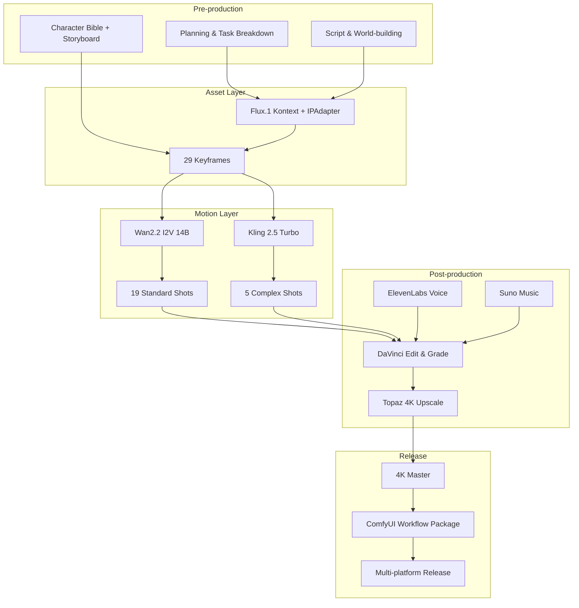

# Project Singularity — The AIGC Production Chain

> This doc explains the full AIGC video production chain covered by Project Singularity, and the concrete problem each stage solves.

[中文](./AIGC_Experience_Chain.md) | English

---

## Why we built this

AIGC video looks fast in demos, but once you stretch to a 3–5 minute finished piece, the pain points pile up:

- The same face looks like a different person in shot 3 and shot 15.
- A generated shot has six fingers, and you only notice it in post.
- Prompts drift away from the storyboard, so you end up missing coverage.
- Generation parameters are scattered across ComfyUI nodes; move to another machine and you start over.
- Team members work in silos and the assets never line up.

Project Singularity ties these problems into one executable, reproducible, collaborative pipeline. We use a sci-fi short, *Echo of the Singularity*, as a worked example. Every step from script to 4K master is written down as docs, scripts, and workflows so we can reuse it ourselves and others can adapt it.

---

## Full Pipeline

---

## What each stage solves

### Stage 1: Asset Casting & Tech Validation

**Problem**: character inconsistency across shots.

**Our approach**:

- Lock appearance, clothing, and expression anchors in a character bible.
- Bind multi-angle reference images to the Flux workflow with IPAdapter.
- Run blind tests and reroll shots that do not pass.

**Key files**:

- [`02_Scripts/奇点回响_剧本与世界观.md`](./02_Scripts/奇点回响_剧本与世界观.md)
- [`02_Scripts/关键帧提示词汇总表.md`](./02_Scripts/关键帧提示词汇总表.md)
- [`03_Workflows/Flux_Character_Consistency.json`](./03_Workflows/Flux_Character_Consistency.json)
- [`06_Research/QA测试与盲测方案.md`](./06_Research/QA测试与盲测方案.md)

---

### Stage 2: Motion Production

**Problem**: flickering, broken, or narratively wrong video.

**Our approach**:

- Standard shots go through local Wan2.2 I2V: low cost, high control.
- Complex shots go through Kling 2.5 Turbo keyframe-to-keyframe for continuity.
- Wan2.2 uses a High-Noise expert for large motion and a Low-Noise expert to repair broken frames.
- All parameters are logged to CSV for reproducibility and batch reruns.

**Key files**:

- [`03_Workflows/Wan22_Dual_Expert_Video.json`](./03_Workflows/Wan22_Dual_Expert_Video.json)
- [`08_Automation/storyboard_to_video.py`](./08_Automation/storyboard_to_video.py)
- [`08_Automation/kling_video_api.py`](./08_Automation/kling_video_api.py)
- [`08_Automation/video_quality_check.py`](./08_Automation/video_quality_check.py)

---

### Stage 3: Post-production & Sound

**Problem**: AI footage looks like disconnected clips instead of a film.

**Our approach**:

- Rough cut to lock pacing, then picture lock before moving on.
- ElevenLabs for character voice, Suno for atmosphere score.
- DaVinci Resolve for a Teal & Orange sci-fi grade.
- Topaz for 4K upscale and temporal denoise.

**Key files**:

- [`04_SOP/后期制作规范.md`](./04_SOP/后期制作规范.md)
- [`04_SOP/音频制作规范.md`](./04_SOP/音频制作规范.md)
- [`08_Automation/elevenlabs_tts_api.py`](./08_Automation/elevenlabs_tts_api.py)
- [`08_Automation/suno_music_api.py`](./08_Automation/suno_music_api.py)

---

### Stage 4: Release & Workflow Packaging

**Problem**: once finished, the knowledge is lost and the next project starts from zero.

**Our approach**:

- Package ComfyUI workflow JSON.
- Archive SOPs in the repo.
- Use a release checklist so deliverables are not missed.
- Publish tutorials and showcase decks.

**Key files**:

- [`08_Automation/package_workflows.sh`](./08_Automation/package_workflows.sh)
- [`09_Release/release_checklist.md`](./09_Release/release_checklist.md)
- [`09_Release/tutorial_template.md`](./09_Release/tutorial_template.md)
- [`09_Release/presentation_template.md`](./09_Release/presentation_template.md)

---

## Engineering

Beyond creativity, we script the repetitive parts:

| Capability | File |
|------------|------|
| One-click ComfyUI deploy | [`08_Automation/deploy_comfyui.sh`](./08_Automation/deploy_comfyui.sh) |
| Environment preflight | [`08_Automation/preflight_check.py`](./08_Automation/preflight_check.py) |
| Performance benchmark | [`08_Automation/benchmark.py`](./08_Automation/benchmark.py) |
| Batch keyframe generation | [`08_Automation/batch_keyframe_gen.py`](./08_Automation/batch_keyframe_gen.py) |
| Batch video generation | [`08_Automation/storyboard_to_video.py`](./08_Automation/storyboard_to_video.py) |
| Render queue manager | [`08_Automation/render_queue.py`](./08_Automation/render_queue.py) |
| Asset dashboard | [`08_Automation/asset_dashboard.py`](./08_Automation/asset_dashboard.py) |
| Daily brief generator | [`08_Automation/daily_brief.py`](./08_Automation/daily_brief.py) |
| Dual-repo sync | [`08_Automation/sync_repos.sh`](./08_Automation/sync_repos.sh) |

---

## Current State

| Asset Type | Status | Note |
|------------|--------|------|
| Plans / Docs / SOPs | ✅ Complete | Ready to use |
| ComfyUI workflow JSON | ✅ Complete | Flux + Wan2.2 workflows |
| Automation scripts | ✅ Complete | 16 scripts covering main stages |
| Script / Storyboard / Prompts | ✅ Complete | 24 shots + 29 keyframe prompts |
| Character reference PNGs | ⏳ Placeholder | Scripts ready; generate on GPU machine |
| Keyframe PNGs | ⏳ Placeholder | Same as above |
| Video MP4s | ⏳ Placeholder | Same as above |
| Audio assets | ⏳ Placeholder | Same as above |
| Final master | ⏳ Placeholder | Same as above |

> The core value of this repo is the **process, code, and documentation**. Actual PNG/MP4 files are one script run away and do not affect the usefulness of the workflow.

---

## Suggested Reading Order

1. [`README.en.md`](./README.en.md) — project overview
2. [`项目计划书_完整版.md`](./项目计划书_完整版.md) — full plan and technical architecture
3. [`AIGC_Experience_Chain.en.md`](./AIGC_Experience_Chain.en.md) — this doc
4. [`04_SOP/SOP_Project_Singularity.md`](./04_SOP/SOP_Project_Singularity.md) — full operation manual
5. [`08_Automation/README.md`](./08_Automation/README.md) — automation scripts
6. [`07_Team/expert_team.md`](./07_Team/expert_team.md) — team roles
7. [`09_Release/presentation_template.md`](./09_Release/presentation_template.md) — showcase template

---

> Maintained by the Project Singularity team. Updated as the workflow evolves.
