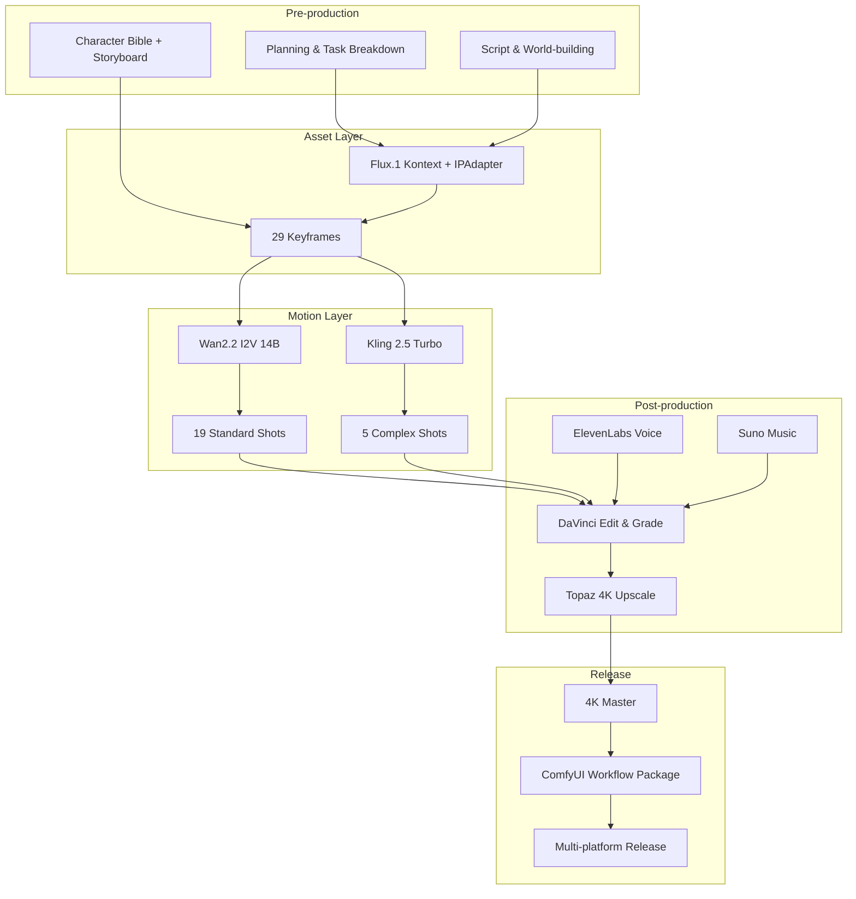

# Project Singularity | Echo of the Singularity

[](./LICENSE)
[](https://www.python.org/downloads/)
[](./03_Workflows/)
[](./docker-compose.yml)
[](./.github/workflows/ci.yml)

> An industrial-grade AIGC video production pipeline template, from script to 4K master.

This repo uses the sci-fi short film *Echo of the Singularity* as a working example. It documents the pitfalls we hit, the parameters we tuned, and the workflows we validated while building AIGC shorts. Use the whole pipeline for your own film, or cherry-pick a single stage (e.g., the character-consistency workflow or the video QA scripts).

[中文](./README.md) | English

---

## What this project does

Making a 3–5 minute AIGC short usually means fighting these problems:

- The same character looks different in every shot.
- Footage flickers, breaks, or moves unnaturally.
- Prompts drift away from the storyboard, leaving you with missing coverage in post.
- Generation parameters are scattered and impossible to reproduce.
- Team members use inconsistent file names and lose track of versions.

Project Singularity ties these loose ends into one reproducible, collaborative pipeline:

1. **Pre-production**: LLM-assisted script, world-building, character bible, shot breakdown.
2. **Assets**: Flux.1 Kontext + IPAdapter for consistent character keyframes.
3. **Motion**: Wan2.2 I2V for standard shots, Kling keyframe-to-keyframe for complex shots.
4. **Post**: DaVinci edit/grade + ElevenLabs voice + Suno music + Topaz upscaling.
5. **Engineering**: ComfyUI JSON workflows, Python automation, QA checks, dual-repo sync.

For the full chain, see [`AIGC_Experience_Chain.en.md`](./AIGC_Experience_Chain.en.md).

---

## Architecture Overview



---

## Repository Mirrors

| Platform | URL |
|----------|-----|
| GitHub | https://github.com/MS33834/Project_Singularity |
| GitCode | https://gitcode.com/badhope/Project_Singularity |

Dual-repo sync is handled by [`08_Automation/sync_repos.sh`](./08_Automation/sync_repos.sh).

Project homepage (GitHub Pages): https://ms33834.github.io/Project_Singularity/

---

## Project Info

- **Codename**: Project Singularity
- **Chinese Title**: 奇点回响 (Echo of the Singularity)
- **Example Runtime**: 3–5 minutes
- **Target Resolution**: 4K
- **Example Genre**: Sci-fi micro-short
- **Planned Cycle**: 6 weeks

> The script, characters, shots, dialogue, and music are examples. Replace them entirely with your own content.

---

## Repository Layout

```
Project_Singularity/
├── 01_Assets/              # Characters, scenes, audio assets
├── 02_Scripts/             # Script, storyboard, prompts
├── 03_Workflows/           # ComfyUI JSON workflows
├── 04_SOP/                 # Manuals and production standards
├── 05_Output/              # Final deliverables
├── 06_Research/            # Tech stack, budget, licensing, tuning notes
├── 07_Team/                # Team roles and task assignments
├── 08_Automation/          # Deployment, generation, QA, sync scripts
├── 09_Release/             # Release checklists and showcase templates
├── examples/               # Example inputs/outputs, including the Echo of the Singularity case study
├── docs/                   # GitHub Pages introduction site
├── .github/                # Issue & PR templates, CI workflows
├── AIGC_Experience_Chain.md      (Chinese)
├── AIGC_Experience_Chain.en.md   (English)
├── CHANGELOG.md
├── CODE_OF_CONDUCT.md
├── CONTRIBUTING.md
├── COST_ANALYSIS.md
├── Dockerfile
├── LICENSE
├── Makefile
├── README.md                     (Chinese)
├── README.en.md                  (English)
├── ROADMAP.md
├── TROUBLESHOOTING.md
├── docker-compose.yml
└── 项目计划书_完整版.md
```

---

## Tech Stack

| Stage | Tool / Model | Purpose |
|-------|--------------|---------|
| Writing | DeepSeek / Claude | Script, world-building, character bible |
| Character Consistency | Flux.1 Kontext + IPAdapter | Character reference images & keyframes |
| Standard Video | Wan2.2 I2V 14B | Image-to-video generation |
| Complex Shots | Kling 2.5 Turbo | Keyframe-to-keyframe generation |
| Editing & Grading | DaVinci Resolve | Edit and color grade |
| Voice | ElevenLabs | Character dialogue |
| Music | Suno / Udio | Atmosphere score |
| Upscaling | Topaz Video AI | 4K upscale and denoise |
| Pipeline Host | ComfyUI | Node-based generation pipeline |

---

## Quick Start

### Option 1: Docker (recommended for a quick look)

```bash
docker compose up -d
```

The container ships with Python dependencies and project scripts. ComfyUI and model weights must be downloaded separately using [`08_Automation/deploy_comfyui.sh`](./08_Automation/deploy_comfyui.sh) due to licensing and size constraints.

### Option 2: Local Source

```bash
# 1. Clone
git clone https://github.com/MS33834/Project_Singularity.git
cd Project_Singularity

# 2. Configure environment
cp .env.example .env
# Edit .env and fill KLING_API_KEY, ELEVENLABS_API_KEY, SUNO_API_KEY, etc.

# 3. Deploy ComfyUI (needs NVIDIA GPU, RTX 4090 24GB recommended)
bash 08_Automation/deploy_comfyui.sh

# 4. Install Python dependencies
pip install -r 08_Automation/requirements.txt

# 5. Health check
make check

# 6. Preflight
python 08_Automation/preflight_check.py

# 7. Batch generate keyframes
python 08_Automation/batch_keyframe_gen.py

# 8. Batch generate video
python 08_Automation/storyboard_to_video.py
```

For common tasks, use `make`:

```bash
make help    # list all commands
make check   # verify project structure
make setup   # install dependencies
make docker  # start Docker container
make test    # run checks
make sync    # push to both remotes
make clean   # remove temp files
```

---

## Examples

The `examples/` directory has ready-to-use samples:

- [`examples/character_prompts.md`](./examples/character_prompts.md): Ava character-consistency prompts
- [`examples/storyboard_sample.md`](./examples/storyboard_sample.md): Simplified storyboard for the first 3 shots
- [`examples/comfyui_api_payload.json`](./examples/comfyui_api_payload.json): Example ComfyUI API payload
- [`examples/env.example`](./examples/env.example): Minimum environment variable template

---

## Hardware Recommendations

| Component | Minimum | Recommended |
|-----------|---------|-------------|
| GPU | RTX 3090 24GB | RTX 4090 24GB |
| RAM | 32GB | 64GB |
| Storage | 200GB SSD | 1TB NVMe |
| OS | Ubuntu 22.04 | Ubuntu 22.04 / Windows 11 |

> If you only have a CPU or no local GPU, switch to cloud APIs such as Kling or Runway for the video stage.

---

## Contributing

Issues and PRs are welcome. See [`CONTRIBUTING.md`](./CONTRIBUTING.md) and [`CODE_OF_CONDUCT.md`](./CODE_OF_CONDUCT.md).

---

## Roadmap

See [`ROADMAP.md`](./ROADMAP.md).

---

## Troubleshooting

See [`TROUBLESHOOTING.md`](./TROUBLESHOOTING.md).

---

## Changelog

See [`CHANGELOG.md`](./CHANGELOG.md).

---

## Cost Analysis

See [`COST_ANALYSIS.md`](./COST_ANALYSIS.md) for rough cost estimates of local GPU vs. cloud API workflows.

---

## License

[MIT License](./LICENSE)

---

> This is a workflow template our team distilled from practice. Open-sourced in the hope that it helps others making AIGC videos. If you have a better way, help us improve it.
