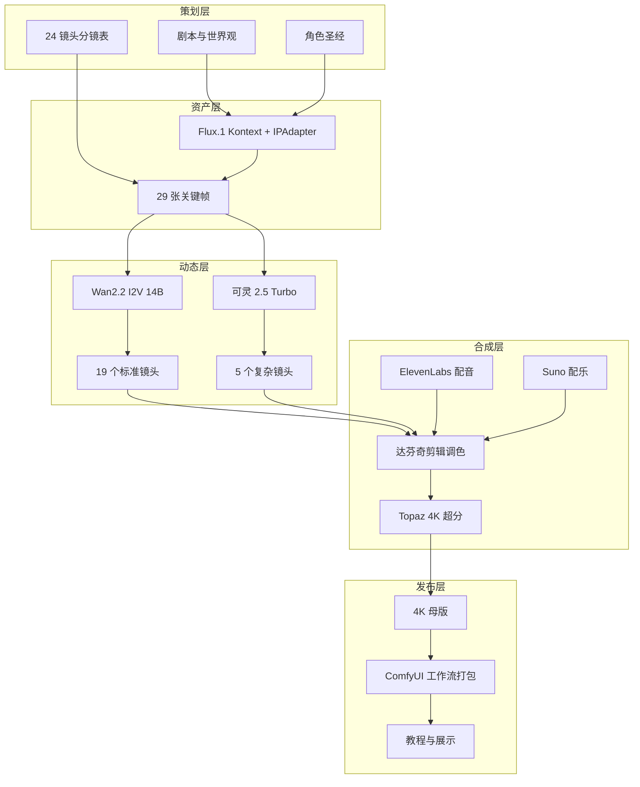

# Project Singularity | 奇点回响

[](./LICENSE)
[](https://www.python.org/downloads/)
[](./03_Workflows/)
[](./docker-compose.yml)
[](./.github/workflows/ci.yml)

中文 | [English](./README.en.md)

> 一套从剧本到 4K 母版的 AIGC 视频工业化流程模板。

本仓库以科幻微短剧《奇点回响》为示例，把我们在 AIGC 短片制作过程中踩过的坑、调过的参数、验证过的流程整理成一套可复用的工作流。你可以直接套用这套流程做自己的短片，也可以只拿走其中某个环节（比如角色一致性方案或视频质检脚本）。

---

## 这个项目能做什么

从零开始做一部 3–5 分钟的 AIGC 短片，通常会遇到这些问题：

- 角色在不同镜头里长得不一样；
- 视频片段闪烁、崩坏、动作不自然；
- 提示词和分镜对不上，后期剪辑时发现缺镜头；
- 生成参数没记录，重跑时完全复现不了；
- 团队协作时文件命名混乱、版本对不上。

这个项目就是把这些零散问题串成一条**可执行的管线**：

1. **策划**：用 LLM 写剧本、做角色圣经、拆镜头；
2. **资产**：用 Flux.1 Kontext + IPAdapter 做角色一致性出图；
3. **视频**：用 Wan2.2 I2V 生成标准镜头，复杂镜头用可灵首尾帧约束；
4. **后期**：达芬奇剪辑调色 + ElevenLabs 配音 + Suno 配乐 + Topaz 超分；
5. **工程化**：ComfyUI 工作流 JSON、Python 自动化脚本、QA 检测、双仓库同步。

详细流程见 [`AIGC_Experience_Chain.md`](./AIGC_Experience_Chain.md)。

---

## 架构概览



---

## 仓库地址

| 平台 | 地址 |
|------|------|
| GitHub | https://github.com/MS33834/Project_Singularity |
| GitCode | https://gitcode.com/badhope/Project_Singularity |

双仓库通过 [`08_Automation/sync_repos.sh`](./08_Automation/sync_repos.sh) 同步。

---

## 项目信息

- **项目代号**：Project Singularity
- **中文名**：奇点回响
- **示例片长**：3-5 分钟
- **目标分辨率**：4K
- **示例体裁**：科幻微短剧
- **拟定周期**：6 周

> 剧本、角色、镜头、对白、配乐都是示例，你可以整体替换为自己的内容。

---

## 目录结构

```
Project_Singularity/
├── 01_Assets/              # 角色/场景/音频资产
├── 02_Scripts/             # 剧本、分镜、提示词
├── 03_Workflows/           # ComfyUI JSON 工作流
├── 04_SOP/                 # 操作手册与制作规范
├── 05_Output/              # 输出成片
├── 06_Research/            # 技术栈、预算、授权、调优记录
├── 07_Team/                # 团队分工与任务分派
├── 08_Automation/          # 部署、生成、质检、同步脚本
├── 09_Release/             # 发布检查清单与展示模板
├── examples/               # 示例输入/输出
├── .github/                # Issue 与 PR 模板
├── AIGC_Experience_Chain.md
├── AIGC_Experience_Chain.en.md
├── CHANGELOG.md
├── CODE_OF_CONDUCT.md
├── CONTRIBUTING.md
├── COST_ANALYSIS.md
├── Dockerfile
├── LICENSE
├── Makefile
├── README.en.md
├── ROADMAP.md
├── TROUBLESHOOTING.md
├── docker-compose.yml
├── 项目计划书_完整版.md
├── 项目进度检查清单.md
└── tasks.md
```

---

## 核心技术栈

| 环节 | 工具/模型 | 用途 |
|------|-----------|------|
| 剧本与角色 | DeepSeek / Claude | 剧本、世界观、角色圣经 |
| 角色一致性 | Flux.1 Kontext + IPAdapter | 角色参考图与关键帧 |
| 标准镜头视频 | Wan2.2 I2V 14B | 图生视频 |
| 复杂/转场镜头 | 可灵 2.5 Turbo | 首尾帧约束生成 |
| 剪辑调色 | 达芬奇 Resolve | 精剪与调色 |
| 配音 | ElevenLabs | 角色对白 |
| 配乐 | Suno / Udio | 氛围音乐 |
| 画质增强 | Topaz Video AI | 4K 超分与降噪 |
| 工作流平台 | ComfyUI | 节点化生成管线 |

---

## 快速开始

### 方式一：Docker（推荐快速体验）

```bash
docker compose up -d
```

容器内已预装 Python 依赖与项目脚本，ComfyUI 与模型仍需按 [`08_Automation/deploy_comfyui.sh`](./08_Automation/deploy_comfyui.sh) 自行下载（受模型授权与体积限制，无法打包进镜像）。

### 方式二：本地源码

```bash
# 1. 克隆仓库
git clone https://github.com/MS33834/Project_Singularity.git
cd Project_Singularity

# 2. 配置环境变量
cp .env.example .env
# 编辑 .env，填入 KLING_API_KEY、ELEVENLABS_API_KEY、SUNO_API_KEY 等

# 3. 部署 ComfyUI（需要 NVIDIA GPU，推荐 RTX 4090 24GB）
bash 08_Automation/deploy_comfyui.sh

# 4. 安装 Python 依赖
pip install -r 08_Automation/requirements.txt

# 5. 预飞行检查
python 08_Automation/preflight_check.py

# 6. 批量生成关键帧
python 08_Automation/batch_keyframe_gen.py

# 7. 批量生成视频
python 08_Automation/storyboard_to_video.py
```

更多细节见 [`08_Automation/README.md`](./08_Automation/README.md)。

---

## Makefile 使用

我们更推荐用 `make` 执行常见操作：

```bash
make help    # 查看所有命令
make check   # 检查项目结构是否完整
make setup   # 安装 Python 依赖
make docker  # Docker 启动
make test    # 运行基础检查
make sync    # 同步双仓库
make clean   # 清理临时文件
```

---

## 示例

`examples/` 目录提供了可以直接运行或参考的示例：

- [`examples/character_prompts.md`](./examples/character_prompts.md)：艾娃角色一致性提示词
- [`examples/storyboard_sample.md`](./examples/storyboard_sample.md)：前 3 个镜头的简化分镜
- [`examples/comfyui_api_payload.json`](./examples/comfyui_api_payload.json)：调用 ComfyUI API 的载荷示例
- [`examples/env.example`](./examples/env.example)：环境变量最小配置

---

## 硬件建议

| 组件 | 最低配置 | 推荐配置 |
|------|----------|----------|
| GPU | RTX 3090 24GB | RTX 4090 24GB |
| 内存 | 32GB | 64GB |
| 磁盘 | 200GB SSD | 1TB NVMe |
| 系统 | Ubuntu 22.04 | Ubuntu 22.04 / Windows 11 |

> 若只有 CPU 或无本地 GPU，可改用可灵/Runway 等云端 API 完成视频生成环节。

---

## 参与贡献

欢迎提交 Issue 和 PR。无论是补充新的 ComfyUI 工作流、改进提示词、修复脚本 Bug，还是补充后期经验，都很有价值。

具体规则见 [`CONTRIBUTING.md`](./CONTRIBUTING.md)，行为准则见 [`CODE_OF_CONDUCT.md`](./CODE_OF_CONDUCT.md)。

---

## 路线图

见 [`ROADMAP.md`](./ROADMAP.md)。

---

## 常见问题

见 [`TROUBLESHOOTING.md`](./TROUBLESHOOTING.md)。

---

## 更新日志

见 [`CHANGELOG.md`](./CHANGELOG.md)。

---

## 费用参考

见 [`COST_ANALYSIS.md`](./COST_ANALYSIS.md)，包含本地 GPU 与云端 API 两种方案的大致成本估算。

---

## 许可证

[MIT License](./LICENSE)

---

> 本项目是我们团队在实践中沉淀的流程模板，开源出来希望能帮到同样在做 AIGC 视频的人。如果你有更好的做法，欢迎一起完善。
